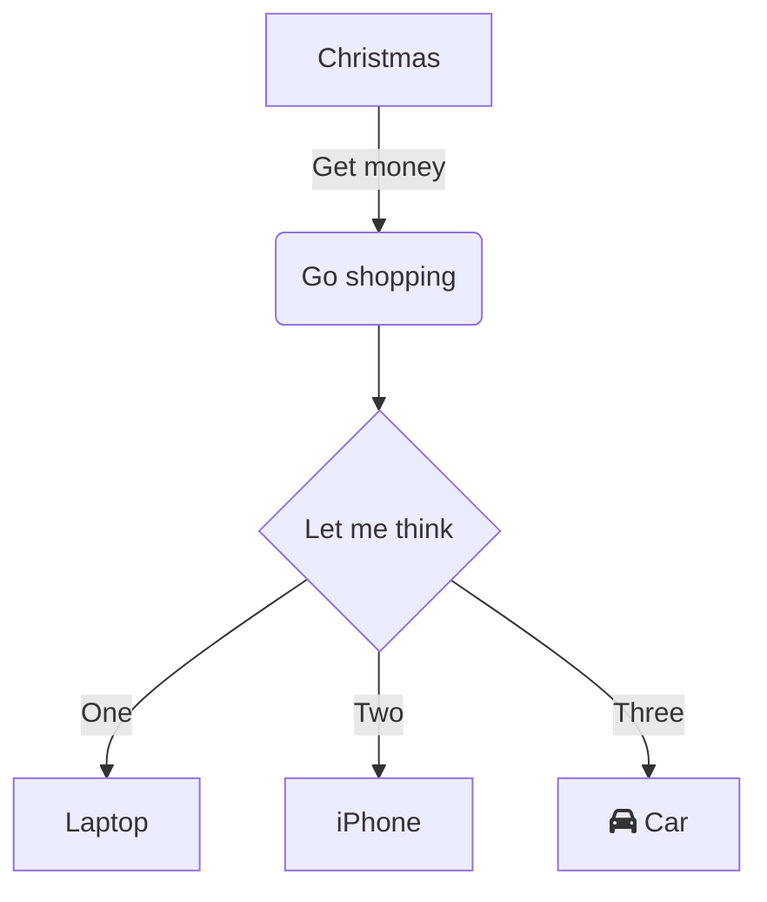
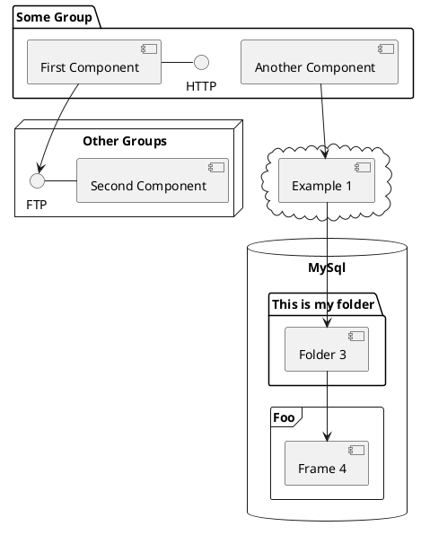

# Event Sourcing Demo

## Architecture Diagram

<br/>

<div align="center"></div>

<br/>

## How to Run

1.  Build your project
    
    ```bash
    ./gradlew clean build --info
    ```
    
2.  Start Zookeeper
    
    ```bash
    zookeeper-server-start /Users/dennis.dao/workspace/app/kafka_2.13-2.8.0/config/zookeeper.properties
    ```
    
3.  Start Kafka
    
    ```bash
    kafka-server-start /Users/dennis.dao/workspace/app/kafka_2.13-2.8.0/config/server.properties
    ```
    
4. Run app with spring profile property `spring.profiles.active`:
* `api-gateway-service` = `default`
  * Access your *Eureka Naming Server* at http://localhost:8761/
  * User: `admin`
  * Password: `password`

* `naming-server` = `default`

* Option 1:
  * `event-storage-service` connects to *kafka* cluster topic to process the event.
  * `default` or `h2`
  * `rocksdb`

  * `command-service` = `camel-kafka`
    * with remote or local kafka broker:
      * local loopback host: `spring.kafka.bootstrap-servers=localhost:9092`
      * remote ip: `spring.kafka.bootstrap-servers=192.168.1.19:9092`

  * `query-service` = `default` or `event-store`

* Option 2:
  * `event-storage-service` = `event-store`
  * `command-service` = `event-store`

    * *This will call `event-store-service` endpoints to process event instead of using `kafka` broker.*

  * `query-service` = `default` or `event-store`

<br/>

<!--MERMAID {width:100}-->

<!--MCONTENT {content: "graph TD<br/>\nA\\[Christmas\\] \\-\\-\\>|Get money| B(Go shopping)<br/>\nB \\-\\-\\> C{Let me think}<br/>\nC \\-\\-\\>|One| D\\[Laptop\\]<br/>\nC \\-\\-\\>|Two| E\\[iPhone\\]<br/>\nC \\-\\-\\>|Three| F\\[fa:fa-car Car\\]"} --->

<br/>



<br/>

This file was generated by Swimm. [Click here to view it in the app](https://app.swimm.io/repos/Z2l0aHViJTNBJTNBZXZlbnQtc291cmNpbmclM0ElM0FzaW1iYXRhaXNh/docs/8xz93).
