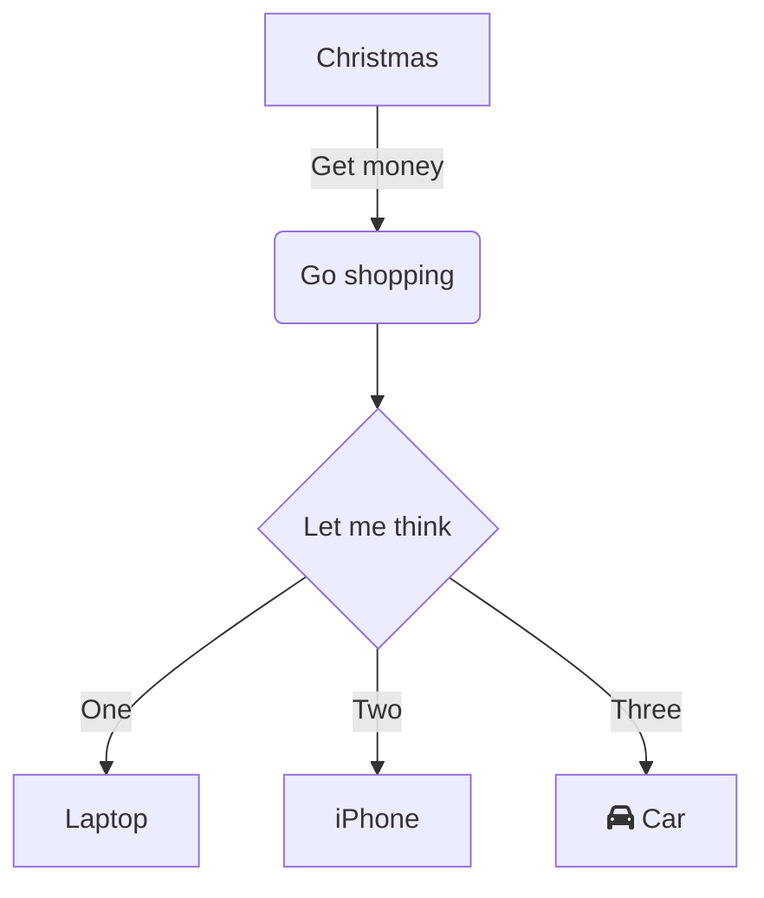

# Event Sourcing Demo

## Architecture Diagram

<p align="center"></p>

## How to Run

1. Build your project

   ```bash
   ./gradlew clean build --info
   ```

2. Start Zookeeper

   ```bash
   zookeeper-server-start /Users/dennis.dao/workspace/app/kafka_2.13-2.8.0/config/zookeeper.properties
   ```

3. Start Kafka

   ```bash
   kafka-server-start /Users/dennis.dao/workspace/app/kafka_2.13-2.8.0/config/server.properties
   ```

4. Run the app with a spring profile property `spring.profiles.active`:

- `api-gateway-service` = `default`

  - Access your *Eureka Naming Server* at <http://localhost:8761/>

  - User: `admin`

  - Password: `password`

- `naming-server` = `default`

- Option 1:

  - `event-storage-service` connects to `kafka` cluster topics to process the event.

  - `default` or `h2`

  - `rocksdb`

  - `command-service` = `camel-kafka`

    - with remote or local `kafka` broker:

      - local loopback host: `spring.kafka.bootstrap-servers=localhost:9092`

      - remote IP: `spring.kafka.bootstrap-servers=192.168.1.19:9092`

  - `query-service` = `default` or `event-store`

- Option 2:

  - `event-storage-service` = `event-store`

  - `command-service` = `event-store`

    - ***This will call*** `event-store-service` ***endpoints to process events instead of using*** `kafka` ***broker.***

  - `query-service` = `default` or `event-store`

*When using a remote broker, the remote* `kafka` `advertised.listeners` *or* `listeners` *in* `server.properties` *should be set to the machine's IP address. If not it will use* `localhost/127.0.0.1`

## How to test

### Postman Collection

Import the API collection from this\
&nbsp;<SwmPath>[docs/resources/CQRS_Event_Sourcing.postman_collection.json](/docs/resources/CQRS_Event_Sourcing.postman_collection.json)</SwmPath>

<p align="center"></p>

&nbsp;

### Using `curl` command

1. Create <SwmToken path="/core-api/src/main/java/com/example/eventstore/model/Board.java" pos="32:4:4" line-data="public class Board {">`Board`</SwmToken> \`getAllBa

   ```bash
   curl --location --request POST 'http://localhost:9080/my-event-store-command/boards/' 
   --header 'Cookie: JSESSIONID=C3FD1BBEE36328C536EF9ED0B7CB5BC8'
   ```

2. Get <SwmToken path="/core-api/src/main/java/com/example/eventstore/model/Board.java" pos="32:4:4" line-data="public class Board {">`Board`</SwmToken>

# Diagram Tool

## D2Lang

<https://d2lang.com>&nbsp;

```javascript
logs: {
  shape: page
  style.multiple: true
}
user: User {shape: person}
network: Network {
  tower: Cell Tower {
    satellites: {
      shape: stored_data
      style.multiple: true
    }

    satellites -> transmitter
    satellites -> transmitter
    satellites -> transmitter
    transmitter
  }
  processor: Data Processor {
    storage: Storage {
      shape: cylinder
      style.multiple: true
    }
  }
  portal: Online Portal {
    UI
  }

  tower.transmitter -> processor: phone logs
}
server: API Server

user -> network.tower: Make call
network.processor -> server
network.processor -> server
network.processor -> server

server -> logs
server -> logs
server -> logs: persist

server -> network.portal.UI: display
user -> network.portal.UI: access {
  style.stroke-dash: 3
}
```

## Eraser.io

<https://app.eraser.io>

## MermaidJs

<https://mermaid.js.org>



## ascii diagram

`ditaa`

```
    @startditaa
    +---------+  /--------\   +-------+
    | cBLU    +--+cAAA    +---+Version|
    |         |  |  Data  |   |   V3  |
    |    +----+  |  Base  |   |cRED{d}|
    |    |cPNK|  |     {s}|   +-------+
    |    |    |  \---+----/
    +----+----+    
    @endditaa
```

- <https://asciiflow.com>

- <https://textik.com/>

## PlantUML

<https://plantuml.com>

### Mingrammer

Diagrams lets you draw the cloud system architecture in Python code. <https://diagrams.mingrammer.com>

## dbdiagram

SQL Database as code <https://dbdiagram.io/home>

<SwmMeta version="3.0.0" repo-id="Z2l0aHViJTNBJTNBZXZlbnQtc291cmNpbmclM0ElM0FzaW1iYXRhaXNh" repo-name="event-sourcing"><sup>Powered by [Swimm](https://app.swimm.io/)</sup></SwmMeta>
