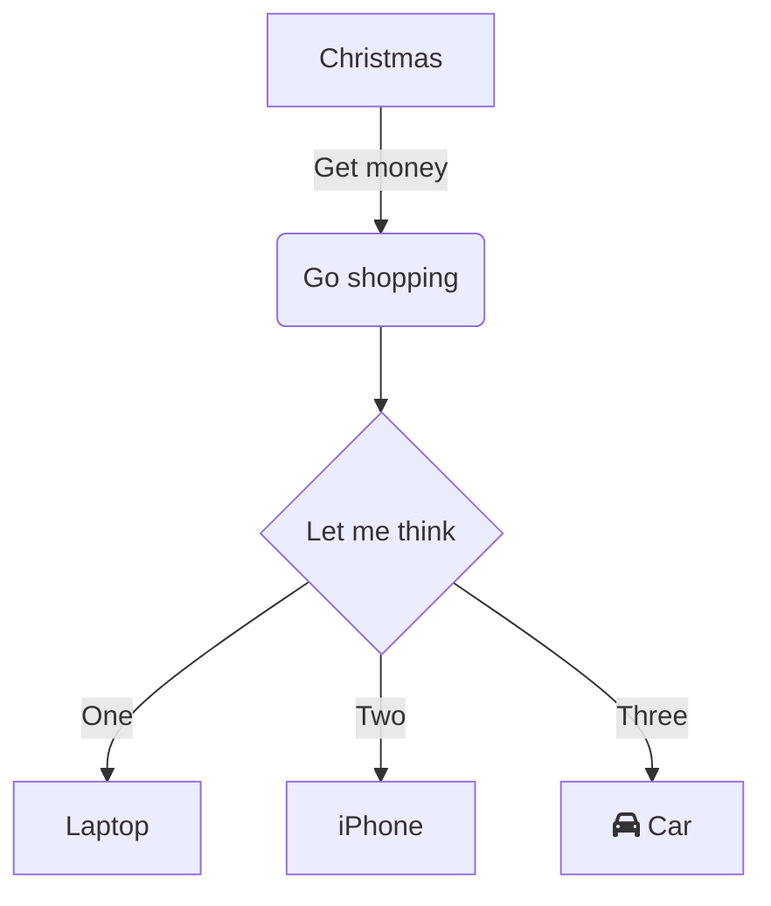

# Event Sourcing Demo

## Architecture Diagram

<br/>

<div align="center"></div>

<br/>

## How to Run

1.  Build your project
    
    ```bash
    ./gradlew clean build --info
    ```
    
2.  Start Zookeeper
    
    ```bash
    zookeeper-server-start /Users/dennis.dao/workspace/app/kafka_2.13-2.8.0/config/zookeeper.properties
    ```
    
3.  Start Kafka
    
    ```bash
    kafka-server-start /Users/dennis.dao/workspace/app/kafka_2.13-2.8.0/config/server.properties
    ```
    
4.  Run the app with a spring profile property `spring.profiles.active`:
    

*   `api-gateway-service` = `default`
    
    *   Access your _Eureka Naming Server_ at [http://localhost:8761/](http://localhost:8761/)
        
    *   User: `admin`
        
    *   Password: `password`
        
*   `naming-server` = `default`
    
*   Option 1:
    
    *   `event-storage-service` connects to `kafka` cluster topics to process the event.
        
    *   `default` or `h2`
        
    *   `rocksdb`
        
    *   `command-service` = `camel-kafka`
        
        *   with remote or local `kafka` broker:
            
            *   local loopback host: `spring.kafka.bootstrap-servers=localhost:9092`
                
            *   remote IP: `spring.kafka.bootstrap-servers=192.168.1.19:9092`
                
    *   `query-service` = `default` or `event-store`
        
*   Option 2:
    
    *   `event-storage-service` = `event-store`
        
    *   `command-service` = `event-store`
        
        *   **_This will call_** `event-store-service` **_endpoints to process events instead of using_** `kafka` **_broker._**
            
    *   `query-service` = `default` or `event-store`
        

_When using a remote broker, the remote_ `kafka` `advertised.listeners` _or_ `listeners` _in_ `server.properties` _should be set to the machine's IP address. If not it will use_ `localhost/127.0.0.1`_<br/>
_

<br/>

<!--MERMAID {width:100}-->
```mermaid
graph TD A[Christmas] -->|Get money| B(Go shopping) B --> C{Let me think} C -->|One| D[Laptop] C -->|Two| E[iPhone] C -->|Three| F[fa:fa-car Car]
```
<!--MCONTENT {content: "graph TD A\\[Christmas\\] \\-\\-\\>|Get money| B(Go shopping) B \\-\\-\\> C{Let me think} C \\-\\-\\>|One| D\\[Laptop\\] C \\-\\-\\>|Two| E\\[iPhone\\] C \\-\\-\\>|Three| F\\[fa:fa-car Car\\]"} --->

<br/>



<br/>

This file was generated by Swimm. [Click here to view it in the app](https://app.swimm.io/repos/Z2l0aHViJTNBJTNBZXZlbnQtc291cmNpbmclM0ElM0FzaW1iYXRhaXNh/docs/8xz93).

<br/>

This file was generated by Swimm. [Click here to view it in the app](https://app.swimm.io/repos/Z2l0aHViJTNBJTNBZXZlbnQtc291cmNpbmclM0ElM0FzaW1iYXRhaXNh/docs/x208s).
