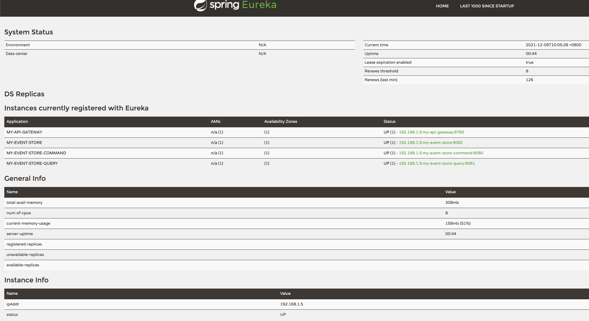
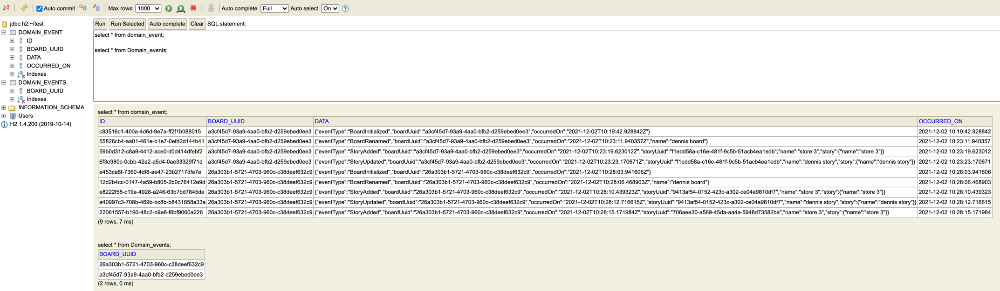

= my-event-store-demo
:icons: font
:iconsdir: docs/resources/icons
:mermaid: ~/node_modules/.bin/mmdc
:mmdc: ~/node_modules/.bin/mmdc
:toc:

== Architecture Diagram

image:docs/resources/images/architecture_diagram.png[]

. Build your project
+
[source,bash]
----
./gradlew clean build --info
----

. Start Zookeeper
+
[source,bash]
----
zookeeper-server-start /Users/dennis.dao/workspace/app/kafka_2.13-2.8.0/config/zookeeper.properties
----

. Start Kafka
+
[source,bash]
----
kafka-server-start /Users/dennis.dao/workspace/app/kafka_2.13-2.8.0/config/server.properties
----
. Start Naming Server Service with `default` profile
+
* Access your *Eureka Naming Server* at http://localhost:8761/
* User: `admin`
* Password: `password`

. Run app with spring `profile`:

* `spring.profiles.active=event-store`
* `spring.profiles.active=camel-kafka`

* **Service and its `profile`:**
* `api-gateway-service` = `default`
* `naming-server` = `default`

* Option 1:
** `event-storage-service` connects to *kafka* cluster topic to process the event.
*** `default` or `h2`
*** `rocksdb`

** `command-service` = `camel-kafka`
*** with remote or local kafka broker:
**** local loopback host: `spring.kafka.bootstrap-servers=localhost:9092`
**** remote ip: `spring.kafka.bootstrap-servers=192.168.1.19:9092`

** `query-service` = `default` or `event-store`

* Option 2:
** `event-storage-service` = `event-store`
** `command-service` = `event-store`
*** This will call `event-store-service` endpoints to process event instead of using `kafka` broker.

** `query-service` = `default` or `event-store`

#_When using remote broker, the remote kafka `advertised.listeners` or `listeners` in `server.properties` should be set to the machine ip address.
If not it will use *"localhost/127.0.0.1"*_#

== How to test

=== Postman Collection

Please import the collection from link:docs/resources/CQRS_Event_Sourcing.postman_collection.json[here].

image::docs/resources/postman.png[]

=== Using `curl` command

. Create `Board`
+
[source,bash]
----
curl --location --request POST 'http://localhost:9080/my-event-store-command/boards/' \
--header 'Cookie: JSESSIONID=C3FD1BBEE36328C536EF9ED0B7CB5BC8'
----

. Get `Board`
+
[source,bash]
----
curl --location --request GET 'http://localhost:9080/my-event-store-command/boards/9b0415a2-d13a-4af3-8fee-9c902d47cc13' \
--header 'Cookie: JSESSIONID=C3FD1BBEE36328C536EF9ED0B7CB5BC8'
----

. Rename `Board`
+
[source,bash]
----
curl --location --request PATCH 'http://localhost:9080/my-event-store-command/boards/9b0415a2-d13a-4af3-8fee-9c902d47cc13?name=dennis 3' \
--header 'Cookie: JSESSIONID=C3FD1BBEE36328C536EF9ED0B7CB5BC8'
----

. Add `Story to Board`
+
[source,bash]
----
curl --location --request POST 'http://localhost:9080/my-event-store-command/boards/9b0415a2-d13a-4af3-8fee-9c902d47cc13/stories' \
--header 'Cookie: JSESSIONID=C3FD1BBEE36328C536EF9ED0B7CB5BC8' \
--form 'name="store 7"'
----

. Update `Story`
+
[source,bash]
----
curl --location --request PUT 'http://localhost:9080/my-event-store-command/boards/9b0415a2-d13a-4af3-8fee-9c902d47cc13/stories/fb7f25d5-3a68-4ab9-9aa9-3546e8847091?name=dennis story 1' \
--header 'Cookie: JSESSIONID=C3FD1BBEE36328C536EF9ED0B7CB5BC8' \
--form 'name="store 3"'
----

. Delete `Story`
+
[source,bash]
----
curl --location --request DELETE 'http://localhost:9080/my-event-store-command/boards/9b0415a2-d13a-4af3-8fee-9c902d47cc13/stories/fb7f25d5-3a68-4ab9-9aa9-3546e8847091' \
--header 'Cookie: JSESSIONID=C3FD1BBEE36328C536EF9ED0B7CB5BC8'
----

== RSocket CLI

You can use https://github.com/rsocket/rsocket-cli[`rsocket-cli`] to test the `rsocket` endpoints

. Install `rsocket-cli`  via `Homebrew` (this does not work for Apple M1) or checkout the code and build it locally.
+
[source,bash]
----
brew install yschimke/tap/rsocket-cli

OR

./gradlew --console plain installDist
----

. Connect to `spring` rsocket server and `route` with following command (`stream`, `request`)
+
[source,bash]
----
rsocket-cli --stream --debug --route=/my-event-store-query/rs/domain-event-stream ws://localhost:9981/rs

rsocket-cli --request --debug --route=/my-event-store-query/rs/boards -i 04474929-5929-4e73-8b87-39feb7a15e6f ws://localhost:9981/rs

./rsocket-cli --help
Usage: rsocket-cli [-hV] [--channel] [--debug] [--fnf] [--metadataPush]
                   [--request] [--resume] [--stream] [--complete=<complete>]
                   [--dataFormat=<dataFormat>] [-i=<input>]
                   [--keepalive=<keepalive>] [-m=<metadata>]
                   [--metadataFormat=<metadataFormat>] [-r=<requestN>]
                   [--route=<route>] [-s=<setup>] [--timeout=<timeout>]
                   [-H=<headers>]... [target]
RSocket CLI command
      [target]              Endpoint URL
      --channel             Channel
      --complete=<complete> Complete Argument
      --dataFormat=<dataFormat>
                            Data Format
      --debug               Debug Output
      --fnf                 Fire and Forget
  -h, --help                Show this help message and exit.
  -H, --header=<headers>    Custom header to pass to server
  -i, --input=<input>       String input or @path/to/file
      --keepalive=<keepalive>
                            Keepalive period
  -m, --metadata=<metadata> Metadata input string input or @path/to/file
      --metadataFormat=<metadataFormat>
                            Metadata Format
      --metadataPush        Metadata Push
  -r, --requestn=<requestN> Request N credits
      --request             Request Response
      --resume              resume enabled
      --route=<route>       RSocket Route
  -s, --setup=<setup>       String input or @path/to/file for setup metadata
      --stream              Request Stream
      --timeout=<timeout>   Timeout in seconds
  -V, --version             Print version information and exit.
----

== Naming Server and Service Registry

== H2 DB in your `jdbc:h2:~/test`

- user: `sa`
- password: _empty_

== Diagram Tools

https://docs.asciidoctor.org/diagram-extension/latest/

. `ditaa` ascii diagram
* https://asciiflow.com
* https://textik.com/
+
[ditaa]
....
+--------+   +-------+    +-------+
|        | --+ ditaa +--> |       |
|  Text  |   +-------+    |diagram|
|Document|   |!magic!|    |       |
|     {d}|   |       |    |       |
+---+----+   +-------+    +-------+
:                         ^
|       Lots of work      |
+-------------------------+
....

. `Plant UML`
+
[plantuml]
....
@startuml

package "Some Group" {
  HTTP - [First Component]
  [Another Component]
}

node "Other Groups" {
  FTP - [Second Component]
  [First Component] --> FTP
}

cloud {
  [Example 1]
}

database "MySql" {
  folder "This is my folder" {
    [Folder 3]
  }
  frame "Foo" {
    [Frame 4]
  }
}

[Another Component] --> [Example 1]
[Example 1] --> [Folder 3]
[Folder 3] --> [Frame 4]

@enduml
....

. `Mermaid`
+
[mermaid]
....
graph TD
    A[Christmas] -->|Get money| B(Go shopping)
    B --> C{Let me think}
    C -->|One| D[Laptop]
    C -->|Two| E[iPhone]
    C -->|Three| F[fa:fa-car Car]
....

image:docs/resources/images/asciidoctor-diagram.png[]
