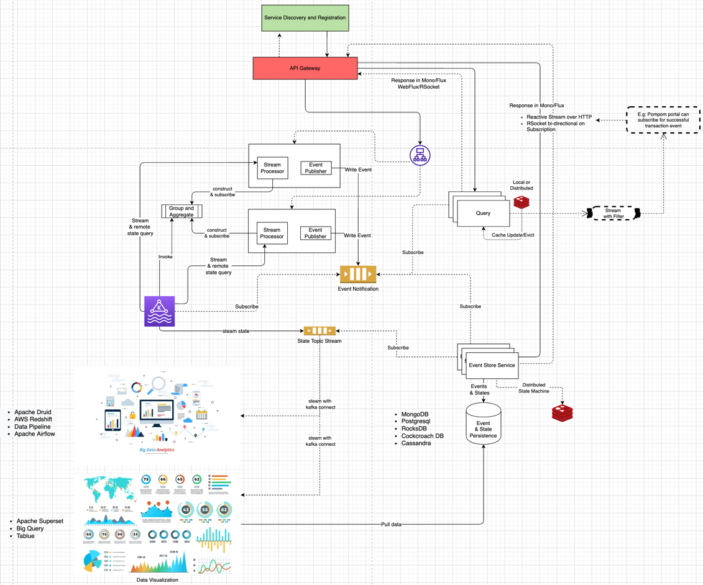

= my-event-store-demo
:icons: font
:iconsdir: docs/resources/icons
:mermaid: ~/node_modules/.bin/mmdc
:mmdc: ~/node_modules/.bin/mmdc
:toc:

== Architecture Diagram

. Build your project
+
[source, bash]
----
./gradlew clean build --info
----

. Start Zookeeper
+
[source,bash]
----
zookeeper-server-start /Users/dennis.dao/workspace/app/kafka_2.13-2.8.0/config/zookeeper.properties
----

. Start Kafka
+
[source,bash]
----
kafka-server-start /Users/dennis.dao/workspace/app/kafka_2.13-2.8.0/config/server.properties
----
. Start Naming Server Service
+
**Please note that the `naming-server` app can be checked out https://bitbucket.org/simbataisa/mynetflix-eureka-naming-server/src/master/[here]**

. Run app with spring `profile`:

  * `spring.profiles.active=event-store`
  * `spring.profiles.active=camel-kafka`

  * **Service and its `profile`:**
    * `api-gateway-service` = `default`
    * Option 1:
      ** `naming-server` = `default`
      ** `api-gateway-service` = `default`
      ** `event-storage-service` = `camel-kafka`
      ** `command-service` = `camel-kafka`
        *** with remote or local kafka broker:
        **** local loopback host: `spring.kafka.bootstrap-servers=localhost:9092`
        **** remote ip: `spring.kafka.bootstrap-servers=192.168.1.19:9092`
      ** `query-service` = `default` or `event-store`
    * Option 2:
      ** `naming-server` = `default`
      ** `api-gateway-service` = `default`
      ** `event-storage-service` = `event-store`
      ** `command-service` = `event-store`
        *** with remote or local kafka broker:
        **** local loopback host: `spring.kafka.bootstrap-servers=localhost:9092`
        **** remote ip: `spring.kafka.bootstrap-servers=192.168.1.19:9092`
      ** `query-service` = `default` or `event-store`

#_When using remote broker, the remote kafka `advertised.listeners` or `listeners` in `server.properties` should be set to the machine
ip address. If not it will use *"localhost/127.0.0.1"*_#

== How to test

=== Postman Collection
Please import the collection from link:docs/resources/CQRS_Event_Sourcing.postman_collection.json[here].

image::docs/resources/postman.png[]

=== Using `curl` command
. Create `Board`
+
[source, bash]
----
curl --location --request POST 'http://localhost:9080/my-event-store-command/boards/' \
--header 'Cookie: JSESSIONID=C3FD1BBEE36328C536EF9ED0B7CB5BC8'
----

. Get `Board`
+
[source, bash]
----
curl --location --request GET 'http://localhost:9080/my-event-store-command/boards/9b0415a2-d13a-4af3-8fee-9c902d47cc13' \
--header 'Cookie: JSESSIONID=C3FD1BBEE36328C536EF9ED0B7CB5BC8'
----

. Rename `Board`
+
[source, bash]
----
curl --location --request PATCH 'http://localhost:9080/my-event-store-command/boards/9b0415a2-d13a-4af3-8fee-9c902d47cc13?name=dennis 3' \
--header 'Cookie: JSESSIONID=C3FD1BBEE36328C536EF9ED0B7CB5BC8'
----

. Add `Story to Board`
+
[source, bash]
----
curl --location --request POST 'http://localhost:9080/my-event-store-command/boards/9b0415a2-d13a-4af3-8fee-9c902d47cc13/stories' \
--header 'Cookie: JSESSIONID=C3FD1BBEE36328C536EF9ED0B7CB5BC8' \
--form 'name="store 7"'
----

. Update `Story`
+
[source, bash]
----
curl --location --request PUT 'http://localhost:9080/my-event-store-command/boards/9b0415a2-d13a-4af3-8fee-9c902d47cc13/stories/fb7f25d5-3a68-4ab9-9aa9-3546e8847091?name=dennis story 1' \
--header 'Cookie: JSESSIONID=C3FD1BBEE36328C536EF9ED0B7CB5BC8' \
--form 'name="store 3"'
----

. Delete `Story`
+
[source, bash]
----
curl --location --request DELETE 'http://localhost:9080/my-event-store-command/boards/9b0415a2-d13a-4af3-8fee-9c902d47cc13/stories/fb7f25d5-3a68-4ab9-9aa9-3546e8847091' \
--header 'Cookie: JSESSIONID=C3FD1BBEE36328C536EF9ED0B7CB5BC8'
----

== RSocket CLI

You can use https://github.com/rsocket/rsocket-cli[`rsocket-cli`] to test the `rsocket` endpoints

. Install `rsocket-cli`  via `Homebrew` (this does not work for Apple M1) or checkout the code and build it locally.
+
[source, bash]
----
brew install yschimke/tap/rsocket-cli

OR

./gradlew --console plain installDist
----

. Connect to `spring` rsocket server and `route` with following command (`stream`, `request`)
+
[source, bash]
----
rsocket-cli --stream --debug --route=/my-event-store-query/rs/domain-event-stream ws://localhost:9981/rs

rsocket-cli --request --debug --route=/my-event-store-query/rs/boards -i 04474929-5929-4e73-8b87-39feb7a15e6f ws://localhost:9981/rs

./rsocket-cli --help
----

== H2 DB in your `jdbc:h2:~/test`
- user: `sa`
- password: _empty_

image:docs/resources/h2.png[h2]

== Diagram Tools
https://docs.asciidoctor.org/diagram-extension/latest/

. `ditaa` ascii diagram
* https://asciiflow.com
* https://textik.com/

[ditaa]
....
+--------+   +-------+    +-------+
|        | --+ ditaa +--> |       |
|  Text  |   +-------+    |diagram|
|Document|   |!magic!|    |       |
|     {d}|   |       |    |       |
+---+----+   +-------+    +-------+
:                         ^
|       Lots of work      |
+-------------------------+
....

. Plant UML
+
[plantuml]
....
@startuml

package "Some Group" {
  HTTP - [First Component]
  [Another Component]
}

node "Other Groups" {
  FTP - [Second Component]
  [First Component] --> FTP
}

cloud {
  [Example 1]
}

database "MySql" {
  folder "This is my folder" {
    [Folder 3]
  }
  frame "Foo" {
    [Frame 4]
  }
}

[Another Component] --> [Example 1]
[Example 1] --> [Folder 3]
[Folder 3] --> [Frame 4]

@enduml
....

. Mermaid
+
[mermaid]
....
sequenceDiagram
  participant U1 as User 1
  participant U2 as User 2
  participant Payment
  participant RC as CRI
  U1->>+ Payment: U1: Redeem Coupon
  Payment->>+ RC: U1: apply coupon
  RC->> RC: U1: Atomically check condition and stock,   decrease stock by 1,   trx = bookingId/invoiceId,   state = reserved
  alt Failure
    RC->>-Payment: U1: coupon apply success
    Payment-->>U1: Display Error and show non-discounted payment info
  else Success
    RC->>Payment: U1: coupon apply success
    Payment-->>U1: Display discounted payment info
    par User 1 run script to remove coupon after clicking PayNow
      U1->>Payment: U1: Click PayNow
      Payment->>+RC: U1: revalidate coupon and indicate Payment start
      RC->>RC: Atomicall revalidate coupon   check if trx = U1: bookingId, state = reserved?
      alt Not Found
        RC-->>Payment: Failed validation
        Payment-->>U1: Error message and display non-discounted payment info
      else Found
        RC->>RC: Atomically update state = PAYMENT_INPROGRESS
        Note over RC: update stage of this voucher to   prevent it from being removed/detached
        RC-->>-Payment: U1: succesful validation
        Payment->>Payment: U1: Process Payment
        alt Success Payment
          Payment->>+RC: U1: Payment success
          RC->>-RC: Atomically update coupon state = PAID
          Payment-->>U1: U1: Display Success
        else Fail Payment
          Payment->>+RC: U1: Payment fail
          RC->>-RC: Atomically update coupon state = active, trx = null, stock increase by 1
          Payment-->>-U1: U1: Display payment fail
        end
      end
    and U1 tries to remove coupon
      loop keep running to increase more stock
        U1->>+Payment: U1: Remove Coupon
        Payment->>+ RC: U1: Remove coupon
        RC->>RC: U1: Atomically check   trx = U1: bookingId/invoiceId,   state = reserved?
        alt Found
          RC->>RC: Atomically update coupon state = ACTIVE,   trx = null
          RC-->>Payment: Remove Coupon Success
          Payment-->>U1: Remove Coupon Success
        else Not Found
          RC-->>-Payment: Remove Coupon Failure
          Payment-->>-U1: Remove Coupon Failure
        end
      end
    and U2 tries to apply coupon
      loop until success
        U2->>+ Payment: U2: Redeem Coupon
        Payment->>+ RC: U2: apply coupon
        RC->> RC: U2: U1: Atomically check condition and stock,   decrease stock by 1,   trx = bookingId/invoiceId,   state = reserved
      end
      RC-->>-Payment: U2: coupon apply success
      Note over Payment, RC: This can only be success if U1 booking has removed the coupon   and detach from booking
      Payment-->>-U2: Display discounted payment info
      U2->>+Payment: U2: Click PayNow
      Payment->>+RC: U2: revalidate coupon
      RC-->>-Payment: U2: succesful validation
      Payment->>Payment: U2: Process Payment
      Payment-->>-U2: U2: Display Success
    end
  end
....
