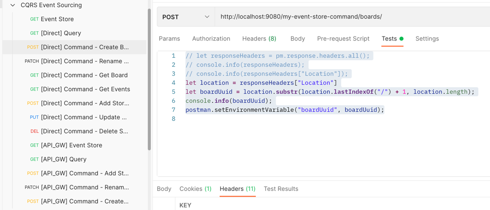

# my-event-store-command

## How to run
1. Start Naming Server Service
2. Start Zookeeper 
```bash
zookeeper-server-start /Users/dennis.dao/workspace/app/kafka_2.13-2.8.0/config/zookeeper.properties
```
3. Start Kafka
```bash
kafka-server-start /Users/dennis.dao/workspace/app/kafka_2.13-2.8.0/config/server.properties
```
4. Run app with spring `profile`:
- `spring.profiles.active=event-store`
- `spring.profiles.active=camel-kafka`
- **Please note that the `naming-server` app can be checked out [here](https://bitbucket.org/simbataisa/mynetflix-eureka-naming-server/src/master/)**

- **Service and its `profile`:**
  - `api-gateway-service` = `default`
  - Option 1:
    - `naming-server` = `default`
    - `api-gateway-service` = `default`
    - `event-storage-service` = `camel-kafka`
    - `command-service` = `camel-kafka` 
      - with remote or local kafka broker:
        - local loopback host: `spring.kafka.bootstrap-servers=localhost:9092`
        - remote ip: `spring.kafka.bootstrap-servers=192.168.1.19:9092`
    - `query-service` = `default` or `event-store`
  - Option 2:
    - `naming-server` = `default`
    - `api-gateway-service` = `default`
    - `event-storage-service` = `event-store`
    - `command-service` = `event-store`
      - with remote or local kafka broker:
      - local loopback host: `spring.kafka.bootstrap-servers=localhost:9092`
      - remote ip: `spring.kafka.bootstrap-servers=192.168.1.19:9092`
    - `query-service` = `default` or `event-store` 

<span style="font-size: larger; font-weight: bold; color: deeppink">
  When using remote broker, the remote kafka `advertised.listeners` or `listeners` <br>
  in `server.properties` should be set to the machine ip address. If not it will use "localhost/127.0.0.1"
</span>                                         

## How to test
                       
### Postman Collection
Please import the collection from [here](docs/resources/CQRS%20Event%20Sourcing.postman_collection.json)



### Using `curl` command
1. Create `Board`
```bash
curl --location --request POST 'http://localhost:9080/my-event-store-command/boards/' \
--header 'Cookie: JSESSIONID=C3FD1BBEE36328C536EF9ED0B7CB5BC8'
```

2. Get `Board`
```bash 
curl --location --request GET 'http://localhost:9080/my-event-store-command/boards/9b0415a2-d13a-4af3-8fee-9c902d47cc13' \
--header 'Cookie: JSESSIONID=C3FD1BBEE36328C536EF9ED0B7CB5BC8'
```

3.  Rename `Board`
```bash
curl --location --request PATCH 'http://localhost:9080/my-event-store-command/boards/9b0415a2-d13a-4af3-8fee-9c902d47cc13?name=dennis 3' \
--header 'Cookie: JSESSIONID=C3FD1BBEE36328C536EF9ED0B7CB5BC8'
```

4. Add `Story to Board`
```bash
curl --location --request POST 'http://localhost:9080/my-event-store-command/boards/9b0415a2-d13a-4af3-8fee-9c902d47cc13/stories' \
--header 'Cookie: JSESSIONID=C3FD1BBEE36328C536EF9ED0B7CB5BC8' \
--form 'name="store 7"'
```
5. Update `Story`
```bash
curl --location --request PUT 'http://localhost:9080/my-event-store-command/boards/9b0415a2-d13a-4af3-8fee-9c902d47cc13/stories/fb7f25d5-3a68-4ab9-9aa9-3546e8847091?name=dennis story 1' \
--header 'Cookie: JSESSIONID=C3FD1BBEE36328C536EF9ED0B7CB5BC8' \
--form 'name="store 3"'
```
6. Delete `Story`
```bash
curl --location --request DELETE 'http://localhost:9080/my-event-store-command/boards/9b0415a2-d13a-4af3-8fee-9c902d47cc13/stories/fb7f25d5-3a68-4ab9-9aa9-3546e8847091' \
--header 'Cookie: JSESSIONID=C3FD1BBEE36328C536EF9ED0B7CB5BC8'
```

## H2 DB in your `jdbc:h2:~/test`
- user: `sa`
- password: _empty_


                                             

# TODO: Diagram
